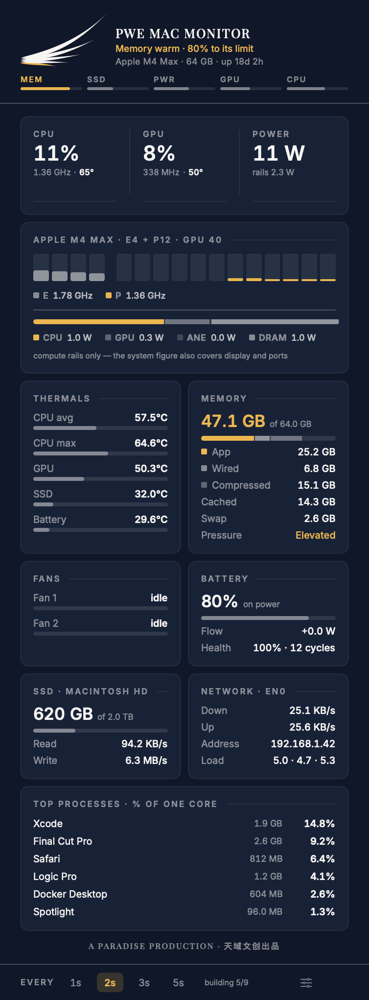
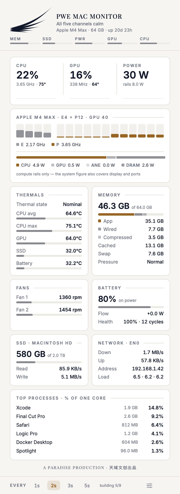

<div align="center">

# PWE MAC MONITOR

**A menu-bar hardware monitor for Apple Silicon Macs.**
One self-contained app — no Homebrew, no helper processes, no runtime to install.

[](https://github.com/kenshinice-ai/pwemacmonitor/releases/latest)
[](#requirements)
[](#requirements)
[](LICENSE)

*A PARADISE PRODUCTION · 天域文创出品*


 

</div>

---

## What it shows

Everything on one page, refreshed every 1–5 seconds.

| Source | Metrics |
|---|---|
| **IOReport** | Per-core frequency and usage for both CPU clusters · GPU frequency and usage · CPU / GPU / Neural Engine / DRAM power |
| **SMC** | CPU and GPU die temperatures · fan RPM and maximum · whole-system power draw |
| **IOHID** | SSD (NAND) temperature · battery temperature · every PMU die sensor — around 200 in total |
| **Mach / sysctl / IOKit** | Memory (app, wired, compressed, cached, swap, pressure) · SSD capacity and throughput · network throughput and address · load average · battery percentage, power flow, cycles and health · top processes |

Two of these are worth calling out, because most menu-bar monitors do not have them:

- **Neural Engine and DRAM power.** The stacked rail under the core row shows where the chip's watts
  actually go — CPU, GPU, ANE, DRAM — read from IOReport's energy model rather than estimated.
- **Per-core residency.** Each bar is one physical core, frequency-weighted, with the efficiency and
  performance clusters distinguished. Hover a bar for its exact frequency.

## Menu bar

Left-click opens the dashboard. Right-click opens settings.

| | |
|---|---|
|  | **Wing only** — the rule under the mark fills with CPU load |
|  | **Power + temperature** |
|  | **CPU + power + temperature** |

### What the colours mean

| Colour | State | Triggered by |
|---|---|---|
| *none — normal ink* | Calm | everything inside the normal envelope |
| **Amber** | Warm | CPU/GPU ≥ 75 °C · SSD ≥ 55 °C · memory pressure elevated · power ≥ 45 % of the chip's envelope |
| **Coral** | Hot | CPU/GPU ≥ 92 °C · SSD ≥ 68 °C · memory critical · power over envelope · battery > 42 °C |

A calm reading is deliberately not coloured. It renders in the ordinary text ink, so colour in this
interface always means *look at me* — you can tell at a glance from across the room whether anything
needs attention. Every reading is graded on its own value: the hottest core and the core average
carry separate verdicts, because it is the hottest one that throttles.

## Install

### Download

1. Grab the `.dmg` from the [latest release](https://github.com/kenshinice-ai/pwemacmonitor/releases/latest).
2. Drag **PWE MAC MONITOR** onto **Applications**.
3. Open it. There is no window — look for the wing in your menu bar.

### Homebrew

```bash
brew install --cask kenshinice-ai/tap/pwe-mac-monitor
```

The cask source lives in [`Casks/pwe-mac-monitor.rb`](Casks/pwe-mac-monitor.rb) and is published to
[kenshinice-ai/homebrew-tap](https://github.com/kenshinice-ai/homebrew-tap).

### First launch: "macOS cannot check it for malicious software"

Releases are ad-hoc signed, not notarised by Apple, so macOS asks before running it once:

1. **System Settings ▸ Privacy & Security**
2. Scroll to **Security**. There is a line about PWE MAC MONITOR being blocked.
3. Click **Open Anyway** and confirm.

Or, from the Terminal:

```bash
xattr -dr com.apple.quarantine "/Applications/PWE MAC MONITOR.app"
```

You only do this once. If you would rather not, [build it from source](#build-from-source) — a
locally built app is never quarantined.

### Requirements

macOS 14 (Sonoma) or later, on an Apple Silicon Mac. Intel is not supported and will not be: the
per-core residency and energy-model counters this app reads do not exist on Intel hardware.

## Build from source

```bash
git clone https://github.com/kenshinice-ai/pwemacmonitor.git
cd pwemacmonitor
./build.sh --run
```

The only requirement is the Xcode Command Line Tools (`xcode-select --install`). There is no Xcode
project and no package manager — `build.sh` calls `swiftc` directly and assembles the bundle.

```bash
./build.sh            # build/PWE MAC MONITOR.app
./build.sh --run      # build, then launch
./build.sh --dmg      # build, then package a disk image
```

`build.sh` picks up a *Developer ID Application* certificate by itself when one is installed, and
falls back to an ad-hoc signature when it is not — saying so plainly either way.

## Releasing

```bash
Tools/release.sh 1.0.1
```

Bumps the version, builds, signs, notarises, staples, asks Gatekeeper for its verdict, tags,
publishes the GitHub release and updates the Homebrew cask. It refuses to start unless the signing
identity and the notarisation credentials are both present, rather than discovering that halfway
through.

Two pieces of one-time setup are needed first, and only the account holder can do them because both
involve Apple credentials:

1. **A Developer ID Application certificate.** Enrolling in the Developer Program does not create
   one. In Keychain Access, *Certificate Assistant ▸ Request a Certificate From a Certificate
   Authority*, saved to disk; upload that CSR at
   [developer.apple.com/account/resources/certificates/add](https://developer.apple.com/account/resources/certificates/add)
   choosing **Developer ID Application**; double-click the downloaded `.cer`.
2. **Notarisation credentials**, stored once in the keychain:

   ```bash
   xcrun notarytool store-credentials pwe --apple-id you@example.com --team-id TEAMID
   ```

   It prompts for an app-specific password, which you create at
   [appleid.apple.com](https://appleid.apple.com) under *Sign-In and Security*.

CI can do the same on a tag push once `MACOS_CERTIFICATE`, `MACOS_CERTIFICATE_PASSWORD`,
`NOTARY_APPLE_ID`, `NOTARY_TEAM_ID` and `NOTARY_PASSWORD` exist as repository secrets; without them
it still builds and publishes an ad-hoc signed disk image.

## Command line

The same binary is a CLI:

```bash
"/Applications/PWE MAC MONITOR.app/Contents/MacOS/pwemon" --probe
```

```
Apple M4 Max · 64 GB · E4+P12 · GPU 40
CPU   17%  E 2113 MHz  P 3847 MHz  temp avg 54.0°C max 61.7°C
GPU   100%  1578 MHz  temp 63.3°C
Power sys 85 W  cpu 0.5 W  gpu 38 W  ane 0.0 W  ram 0.6 W
SSD   28.0°C  r 0 B/s  w 0 B/s  used 932 GB / 2.0 TB
Fans  Fan 1 1351 rpm, Fan 2 1469 rpm
Mem   41.2 GB / 64.0 GB  swap 0.0 GB  pressure 78
Net   ↓ 3.9 MB/s  ↑ 46.0 KB/s
Batt  80% +0.0 W 30.1 °C cycles 11
```

`--json` emits one object per line, including every sensor, for piping into something else.
Add `--loop` to keep going.

## What it costs to run

Measured on an M4 Max with `Tools/bench`, per sample:

| Path | Cost |
|---|---|
| Normal | **19 ms** |
| With the "all sensors" panel open | 82 ms |

Steady state with the dashboard closed, measured over 60 s with `proc_pid_rusage`: **1.1 % of one
core**, ~90 MB resident.

Three findings shaped that, and each contradicted the obvious guess:

- **IOHID costs about 0.22 ms per sensor per read** — 45 ms for a full sweep of ~200 services. The
  client and service list are built once, and only the sensors actually consumed (SSD, battery) are
  read each sample. The full sweep runs only while the sensor panel is open.
- **SMC exposes ~190 temperature keys**, most of them on parked clusters reporting an exact 40.0 °C
  placeholder or a sub-ambient value. Keys are classified at startup and re-classified every 60 s,
  and only the live subset is read. Checked against a full sweep: identical maximum, average within
  1.6 °C.
- **The process table costs 1.3 ms** for every PID on the system — the cheapest source in the app,
  despite looking like the most expensive. It always runs.

## How it is put together

```
Sources/Core/          the sampler — no UI, usable on its own
  CFHelpers.swift        sysctl, IORegistry and dlopen plumbing
  IOReport.swift         private libIOReport.dylib subscription
  SMC.swift              AppleSMC key protocol
  IOHID.swift            IOHIDEventSystemClient temperature sensors
  SocInfo.swift          chip identity and DVFS frequency tables
  SystemStats.swift      memory, disk, network, battery, processes
  Sampler.swift          one Snapshot per interval
Sources/App/           the interface
  Theme.swift            brand tokens and the golden-ratio scale
  BrandMark.swift        generated wing geometry — see Tools/import_wing.py
  Monitor.swift          sampler thread, history, settings
  StatusIcon.swift       menu-bar glyph
  DashboardView.swift    the popover
  Install.swift          first-run install helper
  App.swift              app delegate, menus, CLI
```

Spacing follows the Fibonacci scale (5 · 8 · 13 · 21 · 34), the popover is 377 wide and the history
window is 89 samples — the integer approximation of φ that the wing's own armature is built on.

### Development tools

```bash
"build/PWE MAC MONITOR.app/Contents/MacOS/pwemon" --snapshot docs          # render the UI to PNG
"build/PWE MAC MONITOR.app/Contents/MacOS/pwemon" --popover-test           # popover sizing check
```

`--snapshot` renders the dashboard and every menu-bar style in both appearances without needing
screen-recording permission, and reports the popover height from the first layout pass against the
settled one. `--popover-test` opens a real `NSPopover` off-screen and prints its height over time —
a single stable number is a pass. Add `--demo` to substitute placeholder process names and IP
address when producing images for documentation.

Two macOS traps are worth repeating, since both produced bugs that looked like something else:

- `NSHostingController` does not publish `preferredContentSize` unless you set
  `sizingOptions = [.preferredContentSize]`. `NSPopover` sizes itself from exactly that, so without
  it the dashboard opens cropped to the popover's own 320 pt default while the SwiftUI view is a
  perfectly correct 937 pt. Measuring the hosting *view* proves nothing here.
- SwiftUI does not hit-test a `.fill(.clear)` shape. A button whose unselected background is clear
  is only clickable on its glyphs, so clicks take focus and then cancel. Use `.contentShape()`.

## Credits

**This project stands on [macmon](https://github.com/vladkens/macmon) by
[vladkens](https://github.com/vladkens).** The Apple Silicon telemetry in `Sources/Core` is a Swift
port of macmon's Rust implementation — the IOReport channel handling, the SMC key protocol, the
residency maths and the per-chip quirks were all worked out there first. If you want the same data
in a terminal, or on Intel, use macmon.

[Stats](https://github.com/exelban/stats) by exelban is the reference every macOS system monitor is
measured against, and shaped what this one chose to do differently.

Full notices, including the SIL Open Font License for the bundled typefaces, are in
[THIRD-PARTY-NOTICES.md](THIRD-PARTY-NOTICES.md).

## Licence

Source code: [MIT](LICENSE).

The Paradise Production wing mark, the PWE and Paradise Production names, and the application icon
are **not** covered by that licence. Fork and redistribute freely — but replace
`Sources/App/BrandMark.swift` and the app name with your own, so nobody mistakes your build for an
official one. Details in [LICENSE](LICENSE).
