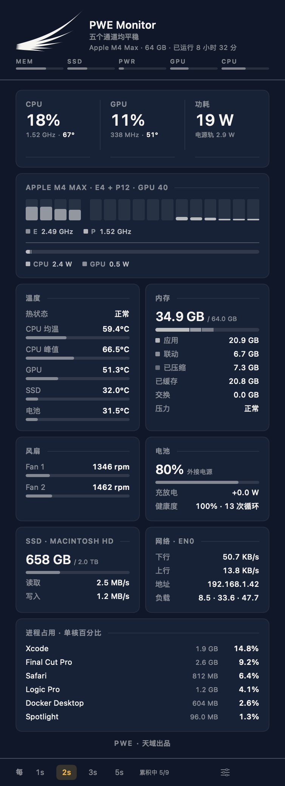
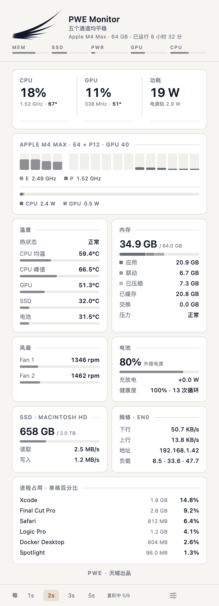
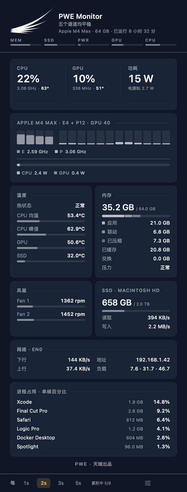
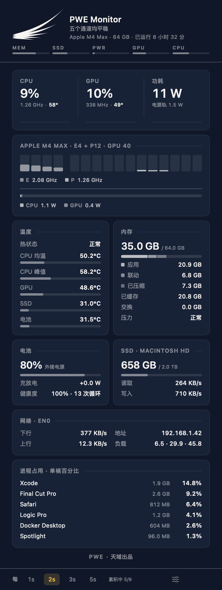

<div align="center">

# PWE Monitor

**Apple 芯片 Mac 的菜单栏硬件监视器。**
一个自包含的 App —— 不装 Homebrew,没有后台守护进程,不需要任何运行时。

[](https://github.com/kenshinice-ai/pwemacmonitor/releases/latest)
[](#系统要求)
[](#系统要求)
[](LICENSE)

*A PARADISE PRODUCTION · 天域文创出品*

[English](README.md) · **简体中文**


 

</div>

---

## 它显示什么

全部读数在一页里,每 1–5 秒刷新一次。

| 数据源 | 指标 |
|---|---|
| **IOReport** | 两个 CPU 簇的逐核频率与占用 · GPU 频率与占用 · CPU / GPU / 神经网络引擎 / DRAM 功耗 |
| **SMC** | CPU 与 GPU 裸片温度 · 风扇转速与上限 · 整机功耗 |
| **IOHID** | 固态硬盘(NAND)温度 · 电池温度 · 全部 PMU 裸片传感器,约 200 个 |
| **Mach / sysctl / IOKit** | 内存(应用、联动、已压缩、已缓存、交换、压力)· 硬盘容量与吞吐 · 网络吞吐与地址 · 负载 · 电池电量、充放电、循环次数与健康度 · 进程占用 |

其中两项值得单独说,因为大多数菜单栏监视器没有:

- **芯片的瓦数去了哪里。** 核心行下方那条堆叠电源轨按路拆分计算功耗 —— CPU、GPU,在 macOS 26
  及更早版本上还有神经网络引擎与 DRAM —— 读自苹果自己的计数器,不是估算出来的。macOS 27 把 CPU、
  ANE、DRAM 的能耗计数器改成每隔几分钟才更新一次;CPU 这一路改从每秒更新的按簇功率直方图恢复,
  ANE 与 DRAM 则不显示,而不是显示成 0。[具体做法与验证](docs/power-rails.md)(英文)。
- **逐核驻留率。** 每一根柱子是一个物理核心,按频率加权,能效核簇与性能核簇分开显示。
  悬停可看该核的确切频率。

## 一句话的结论

羽翼把五个通道精确地表达出来,但它不说话。品牌字下面那一行就是它对应的话 ——
「五个通道均平稳」,或者「内存偏高 · 已达上限 81% · 另有 1 项」。VoiceOver 读到这个标记时
念的也是这句。它是整个面板里唯一在其他一切都安静时仍带颜色的一行,因为**颜色在这个界面里的
意思就是「看这里」**。

## 语言

English 与简体中文。默认跟随你的 Mac;设置菜单里的**语言**可以覆盖它 ——
这一条是必要的,因为相当多的中文用户是刻意把 macOS 跑在英文下的。

两种语言下都保持英文的有五类:品牌字、五个通道键 `MEM SSD PWR GPU CPU`、
电源轨 `CPU GPU ANE DRAM`、单位,以及 `--probe` 和 `--json` 打印的一切 ——
最后一项是机器接口,翻译它会让所有读取它的脚本失效。

## 菜单栏

左键点开面板,右键打开设置。

| | |
|---|---|
|  | **仅羽翼** —— 标记本身就是仪表 |
|  | **功耗 + 温度** |
|  | **CPU + 功耗 + 温度** |

### 它适配你手上这台 Mac

显示哪些卡,由机器实际有什么决定,启动时判断一次:Mac mini、Studio、iMac 没有电池卡,
温度卡里也没有电池行;MacBook Air 没有风扇卡。剩下的卡两两配对,多出单独一张就横跨整行 ——
所以没有哪台 Mac 会一辈子挂着一张写着「无」的卡;在**面板内容**里关掉一张卡,其余的会重新排版,
不会留下空洞。

| MacBook Pro | Mac mini · Studio · iMac | MacBook Air |
|---|---|---|
|  |  |  |

设置菜单里还有**刷新间隔**(1–5 秒)、**面板内容** —— 每一张卡,以及约 200 个 PMU 键的
传感器转储,每一项都可开关并记住 ——
**开机启动**、**语言**、**打开「活动监视器」**——看清是哪个进程占满了核心只是一半,
另一半是去处理它,而这个 App 刻意不具备结束进程的能力 —— 以及**复制诊断信息**,
把 `--probe` 的读数连同版本号和系统版本一起放进剪贴板,方便报障。

### 标记就是仪表

羽翼不是摆在读数旁边的装饰。它的五根羽毛各是一个健康通道 —— 内存、存储、功耗、GPU、CPU,
从底部最短的那根向外读。某个通道越接近上限,颜色就沿那根羽毛越往外走,
于是面板的头部不用你读任何一个数字就能告诉你**是哪个子系统**在吃力。

菜单栏里的羽翼只带一种颜色,不是五种:22 pt 下一根羽毛只有约一个点宽,五种色调在那里会糊成一片。
整体着色回答菜单栏唯一能回答的问题 —— 有没有出问题 —— 其余交给面板。
[完整的设计记录,包括最终定案的原型,在 `docs/wing-states.md`](docs/wing-states.md)(英文)。

一切正常时,标记按品牌标准的原样实心绘制。

### 颜色的含义

| 颜色 | 状态 | 触发条件 |
|---|---|---|
| *无 —— 正常字色* | 平稳 | 全部处于正常区间 |
| **琥珀** | 偏高 | macOS 报告热压力 · 内存压力偏高 · SSD ≥ 55 °C · 裸片或电源轨接近上限 |
| **珊瑚红** | 临界 | macOS 正在强制降温 · 内存紧张 · SSD 超出 68 °C 额定 · 电池超出 38–42 °C 或电量将尽 |

珊瑚红只留给**判定** —— 由 macOS 或厂商规格认定「出问题了」的东西。我们自己拿阈值去卡的**量**
(裸片温度、瓦数)无论多高,最多到琥珀。这不是风格选择:被替换掉的那套阈值,在一台 M4 Max 上
连续 147 个采样点全判为「临界」,而 macOS 从未说到过 `serious`;日常浏览的峰值离红色只差 2.5 °C。
[实测数据与判定策略见 `docs/thermal-verdict.md`](docs/thermal-verdict.md)(英文)。

平稳的读数**刻意不着色**,用普通字色绘制,所以这个界面里出现颜色永远意味着*看这里* ——
隔着一段距离扫一眼就知道有没有需要处理的事。每个读数按自己的值分级:最热的核心和核心均温
各有各的判定,因为触发降频的是最热的那一个。

## 安装

### 下载

1. 从[最新发布](https://github.com/kenshinice-ai/pwemacmonitor/releases/latest)取 `.dmg`。
2. 把 **PWE Monitor** 拖进**应用程序**。
3. 打开它。它没有窗口 —— 在菜单栏里找那个羽翼。

### Homebrew

```bash
brew install --cask kenshinice-ai/tap/pwe-mac-monitor
```

Cask 源在 [`Casks/pwe-mac-monitor.rb`](Casks/pwe-mac-monitor.rb),发布在
[kenshinice-ai/homebrew-tap](https://github.com/kenshinice-ai/homebrew-tap)。

### 升级

```bash
brew upgrade --cask kenshinice-ai/tap/pwe-mac-monitor
```

如果 Homebrew 说*已经是最新版本*但菜单栏里还是旧的,是你本地的 tap 副本过期了 ——
Homebrew 不会在每条命令时都重新拉取第三方 tap:

```bash
brew update && brew upgrade --cask kenshinice-ai/tap/pwe-mac-monitor
```

Cask 会在替换前先退出正在运行的 App,菜单栏应用需要这一步:否则包体会在进程运行时被换掉,
旧版本会一直留在菜单栏里直到下次登录。

直接下的 `.dmg`?先从菜单栏退出,再把新的拖过去。

### 校验下载

发布版本用 Developer ID 证书签名并经 Apple 公证,不会出现「无法验证开发者」的提示。
想自己校验的话,在下载目录里执行:

```bash
shasum -a 256 -c SHA256SUMS.txt
```

## 系统要求

macOS 14(Sonoma)或更高,Apple 芯片 Mac(M1 及以后)。

**不支持 Intel Mac,并且不会支持**:功耗和逐核数据来自 Apple 芯片上的性能计数器,
Intel 硬件上不存在这些计数器。

## 命令行

```bash
"/Applications/PWE Monitor.app/Contents/MacOS/pwemon" --probe        # 人类可读的一次读数
"/Applications/PWE Monitor.app/Contents/MacOS/pwemon" --json --loop  # 每行一个 JSON,持续输出
```

这两个输出是机器接口,固定为英文。

## 从源码构建、内部实现与发布流程

见 [English README](README.md) —— 构建、性能开销、代码结构和发布步骤都在那里,
面向的是会去读源码的人。

## 授权

MIT。见 [LICENSE](LICENSE) 与 [THIRD-PARTY-NOTICES.md](THIRD-PARTY-NOTICES.md)。
