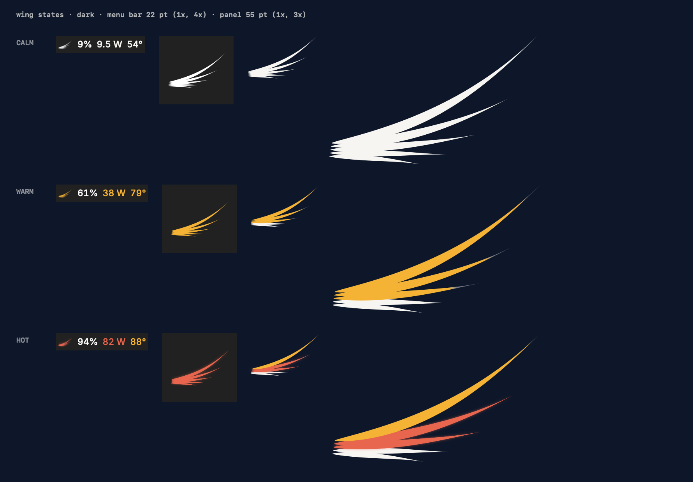

# Wing states

The mark is the gauge. Each of the five feathers is one health channel: how far colour has
travelled out along a feather is how close that channel is to trouble, and the colour itself is
which tier it has entered.

This replaces the separate status rule that used to sit under the menu-bar glyph, and the
CALM / WARM / HOT pill that used to sit in the panel header. Both said what the mark now says,
in space the mark already occupied.

Drawing the mark this way needs an exception to the Paradise identity standard, which forbids
gradients, glow and recolouring. The exception is written down as **§7.1 衍生仪表例外**, and its
boundary is one sentence: *the mark may move as an instrument; it may not move as identity.*
Nothing outside this application is covered — the app icon, the DMG, this README and the website
all use the plain mark, and `Tools/icon/main.swift` was deliberately left alone.



*Generated by `pwemon --wing-states`. Left to right: the menu-bar glyph at actual size and at 4x,
then the panel gauge at actual size and at 3x. In `hot`, power and GPU have crossed and carry the
halo; CPU is still amber; memory and storage are calm and stay solid ink.*

## The five channels

Innermost feather first — the short one at the bottom of the fan.

| Feather | Channel | Reading | Warm | Hot |
|---|---|---|---|---|
| 1 | `MEM` Memory | memory pressure, and used ratio | pressure < 75 % or used > 0.85 | pressure < 45 % |
| 2 | `SSD` Storage | SSD temperature | 55 °C | 68 °C |
| 3 | `PWR` Power | package watts, with battery folded in | 45 % of the chip envelope | envelope |
| 4 | `GPU` GPU | GPU die temperature | 75 °C | 92 °C |
| 5 | `CPU` CPU | hottest CPU core | 75 °C | 92 °C |

Five channels because there are five feathers and the standard fixes that count, so battery rides
with power rather than claiming a feather of its own. Nothing is lost: `overall` covered exactly
these six readings before, and now derives from the same five channels.

### One number, two expressions

`Snapshot.channels(chipClass:)` is the only place a band is decided. `overall`, the menu-bar
glyph, the panel gauge and the legend all read from it, so a feather's length can never disagree
with its colour, or with the number printed on the card below.

Each channel is first converted to **strain** — the distance it has travelled toward its own hot
threshold, on a scale shared by every channel:

```
strain = 0     at rest
       = 0.72  exactly at the channel's warm threshold
       = 1.0   exactly at the channel's hot threshold
```

The band is then just `grade(strain)`, and the fill is the strain itself. Because the scale is
shared, warm begins at the same point on every feather: three-quarters of the way out means the
same thing whether the channel counts watts or degrees.

The thresholds themselves are unchanged — `Health.strain` is calibrated so each channel's warm and
hot points land exactly where the existing `*Health` properties put them.

## What the menu bar can and cannot carry

The design called for all five colours everywhere. At 22 pt it does not work.

A real-size prototype rendered calm, warm and hot in both appearances, at actual size against a
menu-bar background and magnified. At that size each feather is roughly 1 pt thick, and five tints
collapse into a mottled streak: legible as *something is wrong*, useless for *what*. Beside it, a
single overall colour reads instantly and still looks like the wing.

So the bar shows one colour, the panel shows five — which is the fallback the design named as its
own way out, and the panel is where a feather is thick enough to hold a colour anyway.

Two things came out of that prototype that the design had not anticipated:

**A calm channel draws solid, with no gauge at all.** The first cut gave every feather a lit
portion and a dark rail. At calm that made the mark dim, which in a menu bar reads as a disabled
app rather than a quiet one — and five feathers each breaking at a different position read as a
damaged logo, not as data. Drawing calm channels solid fixes both, and it is the interface's
existing colour rule carried into shape: a normal reading spends none of the reader's attention.
It also means the calm glyph is pixel-for-pixel the one that shipped in 1.0.

**No brightness ramp inside the lit portion.** The design put the feather root at 55 % opacity
rising to 100 % at the tip. At menu-bar size that just made the root look faded and cost
legibility. Extent alone carries the message, and extent is the more precise of the two.

## Glow

Hot only, and only on the feather that crossed. If everything glows, glowing stops being a signal —
and the mark then lights up only when the machine is genuinely in trouble, which is rare.

On paper a bright halo reads as a smudge, so the light theme uses a tighter, darker one
(alpha 0.30 / blur 2.2 against 0.55 / 3.5 on dark).

## No transition animation

Considered and rejected. The glyph redraws when a sample lands, once every 1–5 seconds; a 400 ms
cross-fade would need its own ~60 fps timer, costing more than everything else the icon does put
together. Band changes are rare events, and a jump reports an event more honestly than a fade.
The fill already moves continuously with the reading, so nothing is jumping that shouldn't.

## Cost

`pwemon --bench-icon`, rasterising the whole glyph:

| | per redraw |
|---|---|
| cache hit — reading unchanged | 0.43 ms |
| cache miss | 0.46 ms |
| cache miss, hot, halo drawn | 0.50 ms |

Without the cache the same three are 0.67 / 0.70 / **1.11** ms — the halo is the expensive part,
and hot is exactly when the machine can least spare it. The cache quantises the reading to 5 %
steps, which is under a tenth of a point at menu-bar width.

Do not trust that reasoning without re-running it. The first measurement here appeared to show the
cache saving nothing, because `NSImage`'s drawing handler is lazy: timing `StatusIcon.render`
without rasterising the result measures allocation and nothing else.

## Reading it without colour

Because every channel is on the same strain scale, warm begins at 0.72 of a feather and hot at
1.0 on all five. Feather length and legend-bar length therefore encode the band as well as the
colour does — the gauge is readable without relying on hue at all.

Under **Increase Contrast** the unlit rail climbs from 0.42 to 0.80 (dark) so the whole feather
stays plainly present and only colour separates reached from unreached.

VoiceOver gets `ch.spoken` from the header gauge — "Power hot, 100 percent of the way to its
limit. CPU warm, 88 percent…" — and each legend column carries its own label and value.

## Checking it

```
pwemon --wing-states DIR    # all three states, menu bar and panel, both appearances
pwemon --snapshot DIR       # the real panel, both appearances
pwemon --bench-icon         # redraw cost
pwemon --popover-test       # panel height did not regress
```

`--wing-states` drives the shipping renderer with synthetic readings, because the machine under
your hands is almost always calm. Re-run it after touching `WingGauge.swift` or `StatusIcon.swift`.

## Files

```
Sources/Core/Sampler.swift      Channel, ChannelHealth, Health.strain — the single source
Sources/App/WingGauge.swift     the renderer, shared by menu bar and panel
Sources/App/StatusIcon.swift    menu bar: one colour
Sources/App/DashboardView.swift panel: five colours, plus the legend that names the feathers
Sources/App/BrandMark.swift     generated; paths(in:) and axis(_:in:) are what made this possible
Tools/import_wing.py            exports the per-feather axis from the generator's armature
```

The feather axis is taken from `wing_gen.py`'s own armature, not measured off the exported
outline: a feather tapers to a small but non-zero width at the root, so the outline never passes
through it. A gradient aligned to an estimated axis would read slightly wrong at every value.
